<div align="center">



<br/>
<br/>

</div>

<br/>

## 🧠 About Me

I'm an **AI Engineer & Full-Stack Developer** with a Bachelor's degree in Artificial Intelligence, specializing in designing, fine-tuning, and shipping production-grade **Machine Learning, NLP, Computer Vision, and Generative / Agentic AI** systems.

- 🔭 Currently **Research Associate / AI Engineer at BIIT**, building speech, NLP, computer vision, and content-moderation pipelines for **telecom, healthcare, and transportation** clients
- 🧬 Proficient in **LLMs, Transformers, RAG, Prompt Engineering, and Agentic AI** using PyTorch, TensorFlow, Hugging Face, LangChain, and LangGraph
- 🌐 Ship scalable **full-stack applications** with React.js, Node.js, Express.js, Flask, and FastAPI, backed by SQL, MongoDB, Docker, and AWS
- 🩺 Built **MediTranscribe**, a full-stack AI medical transcription platform — fine-tuned BERT reaches **95% accuracy** across clinical text categories
- 📞 Deployed a **real-time call intent & emotion detection system** (Whisper + Wav2Vec2.0 + Transformers) for production call-center workflows
- 🎓 BS in Artificial Intelligence — PMAS Arid Agriculture University, Rawalpindi, Pakistan 

### 🚀 Currently Building
`AI Call Intent & Emotion Detection` — a real-time telecom pipeline combining Whisper, DistilBERT, and Wav2Vec2.0 behind a low-latency FastAPI service

### 📚 Currently Sharpening
Advanced **Agentic AI** patterns with LangGraph · Scalable **RAG** architectures & vector search · Cloud-native deployment on AWS

---
```markdown
## 🛠️ Tech Stack

### 💻 Programming Languages


---

### 🤖 AI & Machine Learning


---

### 🎨 Frontend Development


---

### ⚙️ Backend Development


---

### 🗄️ Databases


---

### ☁️ Cloud & DevOps


---

### 🧰 Tools


```

## 📊 GitHub Analytics

<div align="center">


<sub></sub>

</div>

---

## 🤝 Connect With Me

<div align="center">

<table>
<tr>
<td align="center" width="25%">
<a href="https://linkedin.com/in/salman-khan-ai-software-engineer/">
<br/>
<sub><b>LinkedIn</b></sub>
</a>
</td>
<td align="center" width="25%">
<a href="mailto:salmank.official751@gmail.com">
<br/>
<sub><b>Email</b></sub>
</a>
</td>
<td align="center" width="25%">
<a href="https://salman-khan-portfolio-murex.vercel.app">
<br/>
<sub><b>Portfolio</b></sub>
</a>
</td>
</tr>
</table>

</div>

---

```markdown
<div align="center">

<h3>🚀 Let's Build the Future with AI</h3>

<p>
Designed & Engineered by <strong>Salman Khan</strong>
</p>

<p>
🤖 AI Engineer • 💻 Software Engineer • ⚡ Full Stack Developer
</p>

<p>
Building scalable AI-powered applications with Python, Machine Learning, Deep Learning, LLMs, RAG, LangChain, LangGraph, React, FastAPI, and AWS.
</p>

---

<sub>✨ Passionate about AI • Open Source • Continuous Learning • Innovation</sub>

<br>

<sub>© 2026 Salman Khan • Made with ❤️ and lots of ☕</sub>

</div>
```
